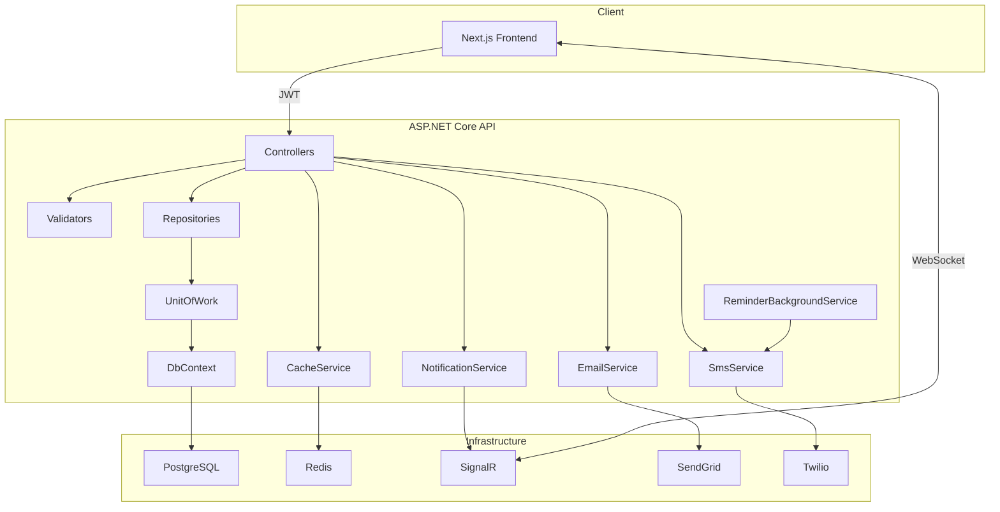

# 📅 Universal Appointment System — Backend API

<div align="center">


**A scalable, multi-tenant appointment management system for any industry**

[Overview](#-project-overview) • [Quick Start](#-quick-start-with-docker) • [Installation](#-manual-installation) • [API](#-api-endpoints) • [Infrastructure](#%EF%B8%8F-core-infrastructure)

</div>

---

## 🚀 Project Overview

A scalable, multi-tenant appointment management system designed for any industry — healthcare, beauty, education, fitness, legal services, and more. Built with clean architecture, JWT authentication, and PostgreSQL for data persistence.

The backend is an **ASP.NET Core Web API** that exposes endpoints for registering users, managing providers and businesses, booking and tracking appointments, and handling notifications and reviews. The API is fully documented using Swagger and supports role-based access control.

### Technologies & Tools

| Category      | Technology                                        |
| ------------- | ------------------------------------------------- |
| Framework     | .NET 8 (ASP.NET Core Web API)                     |
| Database      | Entity Framework Core + Npgsql (PostgreSQL)       |
| Auth          | JWT (Issuer/Audience validation, ClockSkew: zero) |
| Cache         | Redis (StackExchange.Redis)                       |
| Docs          | Swagger / OpenAPI                                 |
| Validation    | FluentValidation                                  |
| Logging       | Serilog (structured request logging)              |
| Testing       | xUnit & Moq                                       |
| DevOps        | Docker / Docker Compose                           |
| SMS           | Twilio                                            |
| Email         | SendGrid                                          |
| Real-time     | SignalR                                           |
| Rate Limiting | Built-in .NET 8                                   |
| Health Checks | PostgreSQL + Redis                                |

---

## 🏗️ Architecture Diagram



---

## 🐳 Quick Start with Docker

The easiest way to get up and running is via Docker Compose:

```bash
# 1. Set up environment variables
cp .env.example .env
# Open .env and fill in DB_PASSWORD and JWT_SECRET

# 2. Start all services (PostgreSQL + Redis + API)
docker compose up --build
```

The API will be available at `http://localhost:5000/swagger`.

---

## 🔴 Redis Setup

Redis is a **required** dependency for 2FA temporary tokens and session data. Without Redis, 2FA, trusted device management, and session caching will not function.

### Docker (Recommended)

```bash
# First-time setup
docker run -d --name redis -p 6379:6379 redis:7-alpine

# Start on subsequent runs
docker start redis

# Verify it's running
docker exec redis redis-cli ping
# Expected: PONG
```

### docker-compose.yml (Production-Like)

```yaml
services:
  redis:
    image: redis:7-alpine
    ports:
      - "6379:6379"
    restart: unless-stopped
    healthcheck:
      test: ["CMD", "redis-cli", "ping"]
      interval: 10s
      timeout: 5s
      retries: 5
```

```bash
docker-compose up -d
```

### Windows — Without Docker

```powershell
# Via winget
winget install Redis.Redis

# Or via Chocolatey
choco install redis-64
```

After installation:

```powershell
redis-server
# In a new terminal:
redis-cli ping   # Should return PONG
```

### Via WSL2

```bash
sudo apt update && sudo apt install redis-server -y
sudo service redis-server start
redis-cli ping   # PONG
```

### Configuration

Redis connection string in `appsettings.Development.json`:

```json
"Redis": {
  "ConnectionString": "localhost:6379,abortConnect=false,connectTimeout=5000,syncTimeout=5000"
}
```

> **Note:** `abortConnect=false` allows the application to start even if Redis is temporarily unavailable. However, Redis-dependent features (2FA etc.) will not work during that period.

### Redis-Backed Features

| Feature                 | Cache Key             | TTL        |
| ----------------------- | --------------------- | ---------- |
| 2FA setup secret        | `2fa_setup:{userId}`  | 10 minutes |
| 2FA login pending token | `2fa_pending:{token}` | 5 minutes  |

---

## 🛠️ Manual Installation

1. Clone the repository:

   ```bash
   git clone <repo-url>
   cd api
   ```

2. Restore packages and apply migrations:

   ```bash
   dotnet restore
   dotnet ef database update
   ```

3. **Configuration** — create `appsettings.Development.json`:

   ```json
   {
     "ConnectionStrings": {
       "DefaultConnection": "Host=localhost;Port=5432;Database=reservation;Username=postgres;Password=YOUR_PASSWORD"
     },
     "Jwt": {
       "Secret": "YOUR_JWT_SECRET_MIN_32_CHARS",
       "Issuer": "reservation-api",
       "Audience": "reservation-client"
     },
     "Redis": {
       "ConnectionString": "localhost:6379"
     },
     "Twilio": {
       "AccountSid": "YOUR_TWILIO_ACCOUNT_SID",
       "AuthToken": "YOUR_TWILIO_AUTH_TOKEN",
       "FromNumber": "+1XXXXXXXXXX"
     },
     "SendGrid": {
       "ApiKey": "YOUR_SENDGRID_API_KEY",
       "FromEmail": "noreply@yourdomain.com",
       "FromName": "Reservation"
     }
   }
   ```

4. Run the application:

   ```bash
   dotnet run
   ```

5. Open Swagger UI at `http://localhost:5000/swagger`

---

## 🔐 Roles & Permissions

| Role     | Description                                              |
| -------- | -------------------------------------------------------- |
| Receiver | Book appointments, cancel, leave reviews                 |
| Provider | Create time slots, manage appointments, reply to reviews |
| Business | Manage business profile and services                     |
| Admin    | Full access including moderation and database seeding    |

---

## 📚 API Endpoints

Use Swagger for the full endpoint list. A high-level summary is provided below.

### Authentication

| Method | Endpoint             | Description                |
| ------ | -------------------- | -------------------------- |
| POST   | `/api/auth/register` | Register new user          |
| POST   | `/api/auth/login`    | Authenticate and issue JWT |

### Categories

| Method | Endpoint               | Description             |
| ------ | ---------------------- | ----------------------- |
| GET    | `/api/categories`      | Get full category tree  |
| GET    | `/api/categories/{id}` | Get category by ID      |
| POST   | `/api/categories`      | Create category (Admin) |

### Businesses

| Method | Endpoint               | Description                |
| ------ | ---------------------- | -------------------------- |
| GET    | `/api/businesses`      | Search & filter businesses |
| GET    | `/api/businesses/{id}` | Get business details       |
| POST   | `/api/businesses`      | Create business (Provider) |
| PUT    | `/api/businesses/{id}` | Update business            |
| DELETE | `/api/businesses/{id}` | Soft delete business       |

### Services

| Method | Endpoint             | Description    |
| ------ | -------------------- | -------------- |
| GET    | `/api/services`      | List services  |
| POST   | `/api/services`      | Create service |
| PUT    | `/api/services/{id}` | Update service |
| DELETE | `/api/services/{id}` | Delete service |

### Time Slots

| Method | Endpoint                            | Description               |
| ------ | ----------------------------------- | ------------------------- |
| GET    | `/api/timeslots/provider/{id}`      | Get provider's time slots |
| POST   | `/api/timeslots/provider/{id}/bulk` | Bulk create time slots    |
| DELETE | `/api/timeslots/{id}`               | Delete time slot          |

### Appointments

| Method | Endpoint                        | Description               |
| ------ | ------------------------------- | ------------------------- |
| GET    | `/api/appointments`             | List appointments         |
| POST   | `/api/appointments`             | Book appointment          |
| GET    | `/api/appointments/{id}`        | Get appointment details   |
| PATCH  | `/api/appointments/{id}/status` | Update appointment status |
| DELETE | `/api/appointments/{id}`        | Cancel appointment        |

### Reviews

| Method | Endpoint                     | Description                 |
| ------ | ---------------------------- | --------------------------- |
| GET    | `/api/reviews/provider/{id}` | Get provider reviews        |
| POST   | `/api/reviews`               | Submit review               |
| DELETE | `/api/reviews/{id}`          | Delete review (Admin/Owner) |

---

## ⚙️ Core Infrastructure

**Repository & Unit-of-Work Pattern** — `IRepository`, `UnitOfWork`, and concrete implementations abstract database access and improve testability.

**Global Exception Middleware** — `GlobalExceptionMiddleware.cs` catches all unhandled exceptions and returns consistent `ApiResponse` objects.

**FluentValidation** — DTOs are validated via validators in the `Validators/` folder (e.g., `AuthValidator`, `ServiceValidator`).

**Redis Cache** — Caching via `ICacheService` / `RedisCacheService` with centralized key management through the `CacheKeys` helper.

**Serilog** — Structured request logging in `{Method} {Path} → {StatusCode} ({Elapsed}ms)` format. Console and file sinks are supported.

**Data Seeding** — `DataSeeder.cs` automatically loads sample users, providers, businesses, services, and categories on application startup.

**JSON Serialization** — Circular reference cycles (`ReferenceHandler.IgnoreCycles`), null fields (`WhenWritingNull`), and enums are serialized as strings (`JsonStringEnumConverter`).

---

## 🛡️ Rate Limiting

The .NET 8 built-in rate limiter is used to prevent abuse and maintain API stability. Returns `429 Too Many Requests` when the limit is exceeded.

| Policy  | Applied To      | Limit                | Purpose                      |
| ------- | --------------- | -------------------- | ---------------------------- |
| `fixed` | All controllers | 60 requests / minute | General API protection       |
| `auth`  | `/api/auth/*`   | 10 requests / minute | Brute-force login protection |

```csharp
// Apply a specific policy to an auth endpoint:
[EnableRateLimiting("auth")]
[HttpPost("login")]
public async Task<IActionResult> Login(...) { }
```

---

## 🏥 Health Checks

The health status of the application and its dependencies can be monitored via the `/health` endpoint. Used by Kubernetes liveness/readiness probes and load balancers.

```
GET /health
```

**Services checked:**

| Service    | Check Method         |
| ---------- | -------------------- |
| PostgreSQL | Test query (NpgSql)  |
| Redis      | Ping (StackExchange) |

**Example response:**

```json
{
  "status": "Healthy",
  "results": {
    "npgsql": { "status": "Healthy" },
    "redis": { "status": "Healthy" }
  }
}
```

---

## 📡 Real-Time Notifications — SignalR

ASP.NET Core SignalR is used to deliver instant notifications to users.

### How It Works

After login, the frontend opens a WebSocket connection to the SignalR hub using a JWT token. When a server-side event occurs (appointment created, confirmed, cancelled, etc.), `INotificationService` delivers the notification to the relevant user in real time.

```
Frontend  ──WebSocket──►  /hubs/notifications  ──►  NotificationService  ──►  User
```

### Hub Endpoint

```
ws://localhost:5000/hubs/notifications
```

Since WebSockets cannot carry headers, the JWT token is passed via query string. This is handled by `JwtBearerEvents.OnMessageReceived`:

```javascript
const connection = new HubConnectionBuilder()
  .withUrl("http://localhost:5000/hubs/notifications", {
    accessTokenFactory: () => session.accessToken,
  })
  .withAutomaticReconnect()
  .build();

connection.on("ReceiveNotification", (notification) => {
  console.log(notification);
});

await connection.start();
```

### SignalR Settings

| Setting                 | Value    | Description                         |
| ----------------------- | -------- | ----------------------------------- |
| `KeepAliveInterval`     | 15s      | Connection keep-alive ping interval |
| `ClientTimeoutInterval` | 30s      | Disconnect if no response received  |
| `EnableDetailedErrors`  | Dev only | Disabled in production              |

### Triggered Events

| Event                           | Recipient           | Description                        |
| ------------------------------- | ------------------- | ---------------------------------- |
| Appointment created             | Receiver + Provider | Both parties notified separately   |
| Status changed (confirm/reject) | Receiver            | Triggered after provider action    |
| Customer cancelled              | Provider            | Provider notified on cancellation  |
| Appointment completed           | Receiver            | Prompts receiver to leave a review |

> **Note:** If running multiple server instances (horizontal scaling), use Redis as the SignalR backplane:
>
> ```csharp
> builder.Services.AddSignalR().AddStackExchangeRedis("localhost:6379");
> ```

---

## ⏰ Reminder Background Service

`ReminderBackgroundService` is an `IHostedService` implementation that starts automatically when the application launches. It sends SMS reminders to users for upcoming appointments.

- Runs periodically in the background with no HTTP request required.
- Uses `ISmsService.SendAppointmentReminderAsync(...)`.
- Gracefully shuts down via `CancellationToken` when the application stops.

---

## 🌐 CORS

Since SignalR WebSocket connections require credentials, `AllowCredentials()` is mandatory. Wildcard origins (`*`) cannot be used with `AllowCredentials()`, so allowed origins are explicitly declared.

```
Allowed origins:
  http://localhost:3000   (Next.js dev)
  http://localhost:5191   (alternative dev port)
```

> In production, these values should be configured via environment variables.

---

## 📧 Email Notifications — SendGrid

**SendGrid** is used for automated email delivery on appointment events.

### Installation

```bash
dotnet add package SendGrid
```

### Emails Sent

| Event               | Recipient           | Content                                      |
| ------------------- | ------------------- | -------------------------------------------- |
| Appointment created | Receiver + Provider | Appointment details and pending status       |
| Status changed      | Receiver            | Confirmation / rejection / completion notice |
| Customer cancelled  | Provider            | Customer name and cancellation reason        |

### Service Interface

```csharp
public interface IEmailService
{
    Task SendAppointmentCreatedAsync(AppointmentEmailDto dto);
    Task SendAppointmentStatusChangedAsync(AppointmentEmailDto dto, string status, string? reason);
}
```

### SendGrid Dashboard

1. Go to [sendgrid.com](https://sendgrid.com) → **Settings → API Keys → Create API Key**
2. Permission: **Mail Send (Full Access)**
3. Complete **Sender Authentication** (domain or single address verification), otherwise emails may land in spam.

> **Note:** SendGrid's free plan allows **100 emails per day**. A paid plan is recommended for production.

---

## 📱 SMS Notifications — Twilio

**Twilio** is used for SMS delivery on appointment events.

### Installation

```bash
dotnet add package Twilio
```

### SMS Messages Sent

| Event                 | Recipient | Example Content                                                                                  |
| --------------------- | --------- | ------------------------------------------------------------------------------------------------ |
| Appointment created   | Receiver  | `Hello Ali, your appointment at Prestige Barber Studio on 07.03.2026 at 12:00 has been created.` |
| Status changed        | Receiver  | `...your appointment has been confirmed / rejected / completed.`                                 |
| Appointment cancelled | Receiver  | `...your appointment has been cancelled.`                                                        |
| Reminder              | Receiver  | `Reminder: You have an appointment on 07.03.2026 at 12:00.`                                      |

### Twilio Account Notes

| Feature                | Trial Account                           | Paid Account                         |
| ---------------------- | --------------------------------------- | ------------------------------------ |
| Message prefix         | `Sent from your Twilio trial account -` | None                                 |
| Alphanumeric Sender ID | ❌ Not supported                        | ✅ Registration required per country |
| Sending restriction    | Verified numbers only                   | All numbers                          |
| Estimated SMS cost     | —                                       | ~$0.05 / SMS                         |

> **Note:** SMS errors do not crash the application — they are logged only. Users without a phone number are automatically skipped.

---

## 🔄 Example API Workflow

1. Provider registers → `POST /api/auth/register` (role=Provider)
2. Provider creates a business → `POST /api/businesses`
3. Provider adds a service → `POST /api/services`
4. Provider sets availability → `POST /api/timeslots/provider/{id}/bulk`
5. Receiver registers → `POST /api/auth/register` (role=Receiver)
6. Receiver books appointment → `POST /api/appointments`
   - ✉️ Email sent (Receiver + Provider)
   - 📱 SMS sent (Receiver)
   - 📡 SignalR notification delivered (Receiver + Provider)
7. Provider confirms → `PATCH /api/appointments/{id}/status`
   - ✉️ Status email sent
   - 📱 Status SMS sent
   - 📡 Real-time notification delivered
8. After completion, receiver reviews provider
   - ⏰ ReminderBackgroundService sends automatic SMS reminder before the appointment

---

## 🌐 Web Frontend

A companion Next.js application lives in the `web` directory.

### Features

- User registration & login (JWT stored in HttpOnly cookies)
- Role-based dashboards (Receiver, Provider, Admin)
- Business/service discovery and search
- Calendar view for time slot selection
- Appointment booking and management
- Provider profile editing, service & slot management
- Review writing and moderation
- Real-time notifications via SignalR (`use-signalr.ts`)

### Frontend Tech Stack

| Technology              | Description          |
| ----------------------- | -------------------- |
| Next.js 14 (App Router) | React framework      |
| TypeScript              | Type safety          |
| Tailwind CSS            | Styling              |
| React Query / SWR       | Data fetching        |
| @microsoft/signalr      | Real-time connection |

```bash
cd web
npm install
npm run dev
# http://localhost:3000
```

The backend URL is configured via `.env.local` (default: `http://localhost:5000`).

---

## 🎯 Seed Data

The following categories are automatically loaded on application startup:

- **Health** (Clinic, Dental, Psychology, Physiotherapy)
- **Beauty** (Hairdresser, Makeup, Nail Art)
- **Fitness** (Personal Trainer, Yoga)
- **Entertainment** (Escape Room, Bowling)
- **Education**
- **Legal & Consulting**

> **Note:** In the development environment, the database is reset on each startup (`EnsureDeleted` + `Migrate`). In production, only `Migrate` runs — existing data is preserved.

---

## 🧩 Testing

```bash
cd api.Tests
dotnet test
```

- **Unit tests** — Controller and service layers are tested in isolation using Moq.
- **Integration tests** — Real HTTP requests are tested via `TestFactory`.
- Use `coverlet` for coverage reports.

### CI Integration

`.github/workflows/ci.yml` automatically runs build, test, and integration tests with a short-lived Redis container on every push.

---

## 🚀 Deployment

Docker Compose brings up all services (PostgreSQL + Redis + API) with a single command. Alternatively, the API can be deployed directly to cloud platforms such as Azure App Service or AWS Elastic Beanstalk.

**Production checklist:**

- Move all secrets from `appsettings.json` to environment variables
- Update the CORS origin list with production domains
- Verify `EnsureDeleted` is guarded inside `IsDevelopment()`
- Add Redis backplane for SignalR if horizontal scaling is needed

---

## 🤝 Contributing

1. **Fork** this repository
2. Create a feature branch:
   ```bash
   git checkout -b feature/AmazingFeature
   ```
3. Commit your changes:
   ```bash
   git commit -m 'feat: add AmazingFeature'
   ```
4. Push your branch:
   ```bash
   git push origin feature/AmazingFeature
   ```
5. Open a **Pull Request**

---

## 📄 License

This project is licensed under the **MIT License**.
