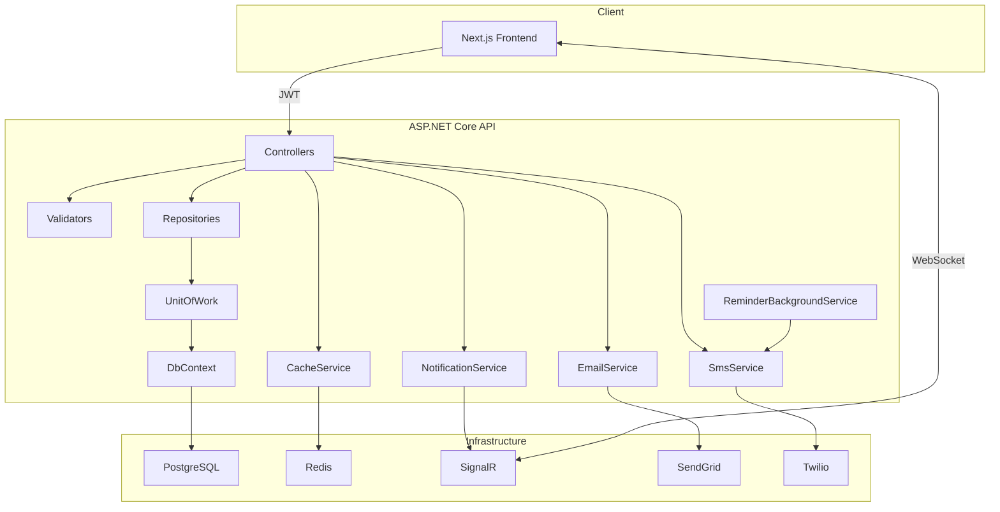

# Universal Appointment System — Backend API

A scalable, multi-tenant appointment management system designed for any
industry—healthcare, beauty, education, fitness, legal services, and more.
Built with clean architecture, JWT authentication, and PostgreSQL for data
persistence.

---

## 🚀 Project Overview

The backend is an ASP.NET Core Web API that exposes endpoints for
registering users, managing providers and businesses, booking and
tracking appointments, and handling notifications and reviews. The API is
fully documented using Swagger and supports role-based access control.

**Technologies & Tools**

- .NET 8 (ASP.NET Core Web API)
- Entity Framework Core with Npgsql (PostgreSQL)
- JWT Authentication (Issuer/Audience validation, ClockSkew: zero)
- Redis (StackExchange.Redis)
- Swagger / OpenAPI
- FluentValidation
- Serilog (structured request logging)
- xUnit & Moq for unit and integration tests
- Docker / Docker Compose
- Twilio (SMS notifications)
- SendGrid (Email notifications)
- SignalR (Real-time notifications)
- Rate Limiting (built-in .NET 8)
- Health Checks (PostgreSQL + Redis)

---

## 🏗 Architecture Diagram



---

## 🐳 Docker ile Hızlı Başlangıç

En kolay kurulum yolu Docker Compose ile:

```bash
# 1. Ortam değişkenlerini ayarla
cp .env.example .env
# .env dosyasını açıp DB_PASSWORD ve JWT_SECRET değerlerini doldur

# 2. Tüm servisleri ayağa kaldır (PostgreSQL + Redis + API)
docker compose up --build
```

API `http://localhost:5000/swagger` adresinde çalışır.

---

## 🔴 Redis Kurulumu

Redis, 2FA geçici token'ları ve oturum verisi için **zorunlu** bir bağımlılıktır. Redis çalışmadan 2FA, güvenilir cihaz yönetimi ve oturum önbellekleme özelliği çalışmaz.

### Docker ile (Önerilen)

```bash
# İlk kurulum
docker run -d --name redis -p 6379:6379 redis:7-alpine

# Sonraki başlatmalarda
docker start redis

# Çalışıp çalışmadığını doğrula
docker exec redis redis-cli ping
# Cevap: PONG
```

### docker-compose.yml ile (Production-Like)

```yaml
services:
  redis:
    image: redis:7-alpine
    ports:
      - "6379:6379"
    restart: unless-stopped
    healthcheck:
      test: ["CMD", "redis-cli", "ping"]
      interval: 10s
      timeout: 5s
      retries: 5
```

```bash
docker-compose up -d
```

### Windows — Docker olmadan

```powershell
# winget ile
winget install Redis.Redis

# Veya Chocolatey ile
choco install redis-64
```

Kurulumdan sonra:

```powershell
redis-server
# Yeni terminalde:
redis-cli ping   # PONG gelmeli
```

### WSL2 üzerinden

```bash
sudo apt update && sudo apt install redis-server -y
sudo service redis-server start
redis-cli ping   # PONG
```

### Konfigürasyon

`appsettings.Development.json` içinde Redis bağlantı dizesi:

```json
"Redis": {
  "ConnectionString": "localhost:6379,abortConnect=false,connectTimeout=5000,syncTimeout=5000"
}
```

> **Not:** `abortConnect=false` sayesinde Redis geçici olarak erişilemez olsa bile uygulama başlamaya devam eder. Ancak Redis gerektiren özellikler (2FA vb.) bu sürede çalışmaz.

### Redis Kullanan Özellikler

| Özellik                | Cache Key             | TTL       |
| ---------------------- | --------------------- | --------- |
| 2FA kurulum secret'ı   | `2fa_setup:{userId}`  | 10 dakika |
| 2FA login geçici token | `2fa_pending:{token}` | 5 dakika  |

---

## 🛠 Manuel Kurulum

1. Repoyu klonla:
   ```bash
   git clone <repo-url>
   cd api
   ```
2. Paketleri yükle ve migration'ları uygula:
   ```bash
   dotnet restore
   dotnet ef database update
   ```
3. **Konfigürasyon** — `appsettings.Development.json` dosyasını oluştur:
   ```json
   {
     "ConnectionStrings": {
       "DefaultConnection": "Host=localhost;Port=5432;Database=reservation;Username=postgres;Password=YOUR_PASSWORD"
     },
     "Jwt": {
       "Secret": "YOUR_JWT_SECRET_MIN_32_CHARS",
       "Issuer": "reservation-api",
       "Audience": "reservation-client"
     },
     "Redis": {
       "ConnectionString": "localhost:6379"
     },
     "Twilio": {
       "AccountSid": "YOUR_TWILIO_ACCOUNT_SID",
       "AuthToken": "YOUR_TWILIO_AUTH_TOKEN",
       "FromNumber": "+1XXXXXXXXXX"
     },
     "SendGrid": {
       "ApiKey": "YOUR_SENDGRID_API_KEY",
       "FromEmail": "noreply@yourdomain.com",
       "FromName": "Reservation"
     }
   }
   ```
4. Uygulamayı başlat:
   ```bash
   dotnet run
   ```
5. Swagger UI: `http://localhost:5000/swagger`

---

## 🔐 Roles & Permissions

| Role     | Description                                              |
| -------- | -------------------------------------------------------- |
| Receiver | Book appointments, cancel, leave reviews                 |
| Provider | Create time slots, manage appointments, reply to reviews |
| Business | Manage business profile and services                     |
| Admin    | Full access including moderation and database seeding    |

---

## 📚 API Endpoints (Selected)

Below is a high-level summary; use Swagger for full details.

### Authentication

| Method | Endpoint             | Description                |
| ------ | -------------------- | -------------------------- |
| POST   | `/api/auth/register` | Register new user          |
| POST   | `/api/auth/login`    | Authenticate and issue JWT |

### Categories

| Method | Endpoint               | Description             |
| ------ | ---------------------- | ----------------------- |
| GET    | `/api/categories`      | Get full category tree  |
| GET    | `/api/categories/{id}` | Get category by id      |
| POST   | `/api/categories`      | Create category (Admin) |

### Businesses

| Method | Endpoint               | Description                |
| ------ | ---------------------- | -------------------------- |
| GET    | `/api/businesses`      | Search & filter            |
| GET    | `/api/businesses/{id}` | Get details                |
| POST   | `/api/businesses`      | Create business (Provider) |
| PUT    | `/api/businesses/{id}` | Update business            |
| DELETE | `/api/businesses/{id}` | Soft delete                |

_(Full endpoint list available in Swagger UI.)_

---

## ⚙️ Core Infrastructure

- **Repository & Unit‑of‑Work Pattern**: `IRepository`, `UnitOfWork` ve concrete implementasyonlar database erişimini soyutlar, test edilebilirliği artırır.
- **Global Exception Middleware**: `GlobalExceptionMiddleware.cs` tüm unhandled exception'ları yakalar ve tutarlı `ApiResponse` nesneleri döner.
- **FluentValidation**: `Validators/` klasöründeki validator'lar (ör. `AuthValidator`, `ServiceValidator`) ile DTO'lar validate edilir.
- **Redis Cache**: `ICacheService` / `RedisCacheService` ile önbellekleme; `CacheKeys` helper'ı ile merkezi key yönetimi.
- **Serilog**: Her HTTP isteği için `{Method} {Path} → {StatusCode} ({Elapsed}ms)` formatında yapılandırılmış request loglama. Console ve dosya sink'leri desteklenir.
- **Data Seeding**: `DataSeeder.cs` uygulama başlarken örnek kullanıcı, provider, business, servis ve kategori verilerini yükler.
- **JSON Serialization**: Dairesel referans döngüleri (`ReferenceHandler.IgnoreCycles`), null alanlar (`WhenWritingNull`) ve enum'lar string olarak serialize edilir (`JsonStringEnumConverter`).

---

## 🛡️ Rate Limiting

Kötüye kullanımı önlemek ve API kararlılığını korumak için .NET 8 built-in rate limiter kullanılmaktadır. Limit aşıldığında `429 Too Many Requests` döner.

| Policy  | Uygulandığı yer    | Limit             | Amaç                       |
| ------- | ------------------ | ----------------- | -------------------------- |
| `fixed` | Tüm controller'lar | 60 istek / dakika | Genel API koruması         |
| `auth`  | `/api/auth/*`      | 10 istek / dakika | Brute-force login koruması |

```csharp
// Auth endpoint'lerine özel policy uygulamak için:
[EnableRateLimiting("auth")]
[HttpPost("login")]
public async Task<IActionResult> Login(...) { }
```

---

## 🏥 Health Checks

Uygulamanın ve bağımlı servislerinin durumu `/health` endpoint'i üzerinden izlenebilir. Kubernetes liveness/readiness probe'ları ve load balancer'lar bu endpoint'i kullanır.

```
GET /health
```

**Kontrol edilen servisler:**

| Servis     | Kontrol Yöntemi         |
| ---------- | ----------------------- |
| PostgreSQL | Test sorgusu (`NpgSql`) |
| Redis      | Ping (`StackExchange`)  |

**Örnek yanıt:**

```json
{
  "status": "Healthy",
  "results": {
    "npgsql": { "status": "Healthy" },
    "redis": { "status": "Healthy" }
  }
}
```

---

## 📡 Real-Time Notifications — SignalR

Kullanıcılara anlık bildirim göndermek için ASP.NET Core SignalR kullanılmaktadır.

### Nasıl Çalışır?

Kullanıcı giriş yaptıktan sonra frontend, JWT token ile SignalR hub'a WebSocket bağlantısı açar. Sunucu tarafında bir işlem gerçekleştiğinde (randevu oluşturma, onaylama, iptal vb.) `INotificationService` üzerinden ilgili kullanıcıya anlık bildirim iletilir.

```
Frontend  ──WebSocket──►  /hubs/notifications  ──►  NotificationService  ──►  Kullanıcı
```

### Hub Endpoint

```
ws://localhost:5000/hubs/notifications
```

WebSocket başlık taşıyamadığı için JWT token query string üzerinden iletilir; bu davranış `JwtBearerEvents.OnMessageReceived` ile handle edilmiştir:

```javascript
const connection = new HubConnectionBuilder()
  .withUrl("http://localhost:5000/hubs/notifications", {
    accessTokenFactory: () => session.accessToken,
  })
  .withAutomaticReconnect()
  .build();

connection.on("ReceiveNotification", (notification) => {
  console.log(notification);
});

await connection.start();
```

### SignalR Ayarları

| Ayar                    | Değer    | Açıklama                         |
| ----------------------- | -------- | -------------------------------- |
| `KeepAliveInterval`     | 15 sn    | Bağlantı canlı tutma ping süresi |
| `ClientTimeoutInterval` | 30 sn    | Cevap gelmezse bağlantı kesilir  |
| `EnableDetailedErrors`  | Dev only | Production'da kapalı             |

### Tetiklenen Olaylar

| Olay                     | Alıcı               | Açıklama                                     |
| ------------------------ | ------------------- | -------------------------------------------- |
| Randevu oluşturuldu      | Receiver + Provider | Her iki tarafa ayrı bildirim gönderilir      |
| Durum değişti (onay/red) | Receiver            | Provider aksiyonu sonrası tetiklenir         |
| Müşteri iptal etti       | Provider            | Receiver iptal ettiğinde provider bildirilir |
| Randevu tamamlandı       | Receiver            | Değerlendirme yapması için yönlendirilir     |

> **Not:** Birden fazla sunucu örneği (horizontal scaling) çalıştırılıyorsa SignalR backplane olarak Redis kullanılmalıdır:
>
> ```csharp
> builder.Services.AddSignalR().AddStackExchangeRedis("localhost:6379");
> ```

---

## ⏰ Reminder Background Service

`ReminderBackgroundService`, uygulama başladığında otomatik olarak çalışan bir `IHostedService` implementasyonudur. Yaklaşan randevular için kullanıcılara SMS hatırlatması gönderir.

- Arka planda periyodik olarak çalışır; herhangi bir HTTP isteği gerektirmez.
- `ISmsService.SendAppointmentReminderAsync(...)` metodunu kullanır.
- Uygulama kapanırken `CancellationToken` ile düzgün şekilde sonlandırılır (graceful shutdown).

---

## 🌐 CORS

SignalR WebSocket bağlantısı `credentials` gerektirdiğinden `AllowCredentials()` zorunludur. Wildcard origin (`*`) ile `AllowCredentials()` birlikte kullanılamaz; bu nedenle izin verilen origin'ler açıkça belirtilmiştir.

```
İzin verilen origin'ler:
  http://localhost:3000   (Next.js dev)
  http://localhost:5191   (alternatif dev port)
```

> Production'da bu değerler environment variable üzerinden yapılandırılmalıdır.

---

## 📧 Email Notifications — SendGrid

Randevu işlemlerinde kullanıcılara otomatik e-posta gönderimi için **SendGrid** entegrasyonu kullanılmaktadır.

### Kurulum

```bash
dotnet add package SendGrid
```

### Gönderilen E-postalar

| Durum               | Alıcı               | İçerik                              |
| ------------------- | ------------------- | ----------------------------------- |
| Randevu oluşturuldu | Receiver + Provider | Randevu detayları ve bekleme durumu |
| Durum değişti       | Receiver            | Onay / red / tamamlandı bilgisi     |
| Müşteri iptal etti  | Provider            | Müşteri adı ve iptal nedeni         |

### Servis Arayüzü

```csharp
public interface IEmailService
{
    Task SendAppointmentCreatedAsync(AppointmentEmailDto dto);
    Task SendAppointmentStatusChangedAsync(AppointmentEmailDto dto, string status, string? reason);
}
```

### SendGrid Dashboard

1. [sendgrid.com](https://sendgrid.com) → **Settings → API Keys → Create API Key**
2. İzin: **Mail Send (Full Access)**
3. **Sender Authentication**: Gönderici domain veya tek adres doğrulaması yapılmalıdır, aksi halde e-postalar spam klasörüne düşer.

> **Not:** SendGrid'in ücretsiz planı günlük **100 e-posta** limitine sahiptir. Production ortamı için ücretli plana geçilmesi önerilir.

---

## 📱 SMS Notifications — Twilio

Randevu işlemlerinde kullanıcılara SMS gönderimi için **Twilio** entegrasyonu kullanılmaktadır.

### Kurulum

```bash
dotnet add package Twilio
```

### Gönderilen SMS'ler

| Durum               | Alıcı    | Örnek İçerik                                                                                |
| ------------------- | -------- | ------------------------------------------------------------------------------------------- |
| Randevu oluşturuldu | Receiver | `Merhaba Ali, Prestige Barber Studio icin 07.03.2026 12:00 tarihli randevunuz olusturuldu.` |
| Durum değişti       | Receiver | `...randevunuz onaylandi / reddedildi / tamamlandi.`                                        |
| İptal edildi        | Receiver | `...randevunuz iptal edildi.`                                                               |
| Hatırlatma          | Receiver | `Hatirlatma: 07.03.2026 12:00 tarihinde ... randevunuz var.`                                |

### Türkçe Karakter Uyumluluğu

GSM 7-bit SMS standardı Türkçe karakterleri desteklemez; gönderimde bozulurlar (örn. `Ü` → `^`). `SmsService` içindeki `N()` yardımcı metodu tüm metni otomatik ASCII'ye normalize eder:

```csharp
private static string N(string text) =>
    text
        .Replace('ç', 'c').Replace('Ç', 'C')
        .Replace('ğ', 'g').Replace('Ğ', 'G')
        .Replace('ı', 'i').Replace('İ', 'I')
        .Replace('ö', 'o').Replace('Ö', 'O')
        .Replace('ş', 's').Replace('Ş', 'S')
        .Replace('ü', 'u').Replace('Ü', 'U');
```

### Twilio Hesap Notları

| Özellik                | Trial Hesap                             | Ücretli Hesap                |
| ---------------------- | --------------------------------------- | ---------------------------- |
| Mesaj öneki            | `Sent from your Twilio trial account -` | Yok                          |
| Alphanumeric Sender ID | ❌ Desteklenmiyor                       | ✅ Ülkeye göre kayıt gerekir |
| Gönderim kısıtlaması   | Yalnızca doğrulanmış numaralar          | Tüm numaralar                |
| Türkiye SMS fiyatı     | —                                       | ~$0.05 / SMS                 |

> **Not:** SMS hatası uygulamayı durdurmaz; hatalar yalnızca loglanır. Telefon numarası olmayan kullanıcılara SMS gönderimi otomatik olarak atlanır.

---

## 🔄 Example API Workflow

1. Provider registers → `POST /api/auth/register` (role=Provider)
2. Provider creates a business → `POST /api/businesses`
3. Provider adds a service → `POST /api/services`
4. Provider sets availability → `POST /api/timeslots/provider/{id}/bulk`
5. Receiver registers → `POST /api/auth/register` (role=Receiver)
6. Receiver books appointment → `POST /api/appointments`
   - ✉️ E-posta gönderilir (Receiver + Provider)
   - 📱 SMS gönderilir (Receiver)
   - 📡 SignalR bildirimi iletilir (Receiver + Provider)
7. Provider confirms → `PATCH /api/appointments/{id}/status`
   - ✉️ Durum e-postası gönderilir
   - 📱 Durum SMS'i gönderilir
   - 📡 Anlık bildirim iletilir
8. After completion, receiver reviews provider
   - ⏰ ReminderBackgroundService randevu öncesi otomatik SMS hatırlatması gönderir

---

## 🌐 Web Frontend

A companion Next.js application lives in the `web` directory.

**Features:**

- User registration & login (JWT stored in HttpOnly cookies)
- Role-based dashboards (receiver, provider, admin)
- Business/service discovery and search
- Calendar view for time slot selection
- Appointment booking and management
- Provider profile editing, service & slot management
- Review writing and moderation
- Real-time notifications via SignalR (`use-signalr.ts`)

**Frontend Tech Stack:**

- Next.js 14 (App Router)
- TypeScript
- Tailwind CSS
- React Query / SWR
- `@microsoft/signalr`

```bash
cd web
npm install
npm run dev
# http://localhost:3000
```

Backend URL `.env.local` ile yapılandırılır (varsayılan: `http://localhost:5000`).

---

## 🎯 Seed Data

Uygulama başlarken aşağıdaki kategoriler otomatik yüklenir:

- **Health** (Clinic, Dental, Psychology, Physiotherapy)
- **Beauty** (Hairdresser, Makeup, Nail Art)
- **Fitness** (Personal Trainer, Yoga)
- **Entertainment** (Escape Room, Bowling)
- **Education**
- **Legal & Consulting**

> **Not:** Development ortamında uygulama her başladığında veritabanı sıfırlanır (`EnsureDeleted` + `Migrate`). Production'da yalnızca `Migrate` çalışır, mevcut veriler korunur.

---

## 🧩 Testing

```bash
cd api.Tests
dotnet test
```

- **Unit testler**: Controller ve servis katmanları Moq ile izole test edilir.
- **Integration testler**: `TestFactory` ile gerçek HTTP istekleri test edilir.
- Coverage raporu için `coverlet` kullanılabilir.

### CI Integration

`.github/workflows/ci.yml` ile her push'ta build, test ve kısa ömürlü Redis container ile integration testler otomatik çalışır.

---

## 🚀 Deployment

Docker Compose ile tüm servisler (PostgreSQL + Redis + API) tek komutla ayağa kalkar. Alternatif olarak Azure App Service, AWS Elastic Beanstalk gibi cloud platformlarına doğrudan deploy edilebilir.

**Production checklist:**

- `appsettings.json` içindeki tüm secret'ları environment variable'a taşı
- CORS origin listesini production domain'leriyle güncelle
- `EnsureDeleted` kodunun `IsDevelopment()` guard'ı içinde kaldığını doğrula
- SignalR için Redis backplane ekle (horizontal scaling durumunda)

---

## 📄 License

MIT License.
