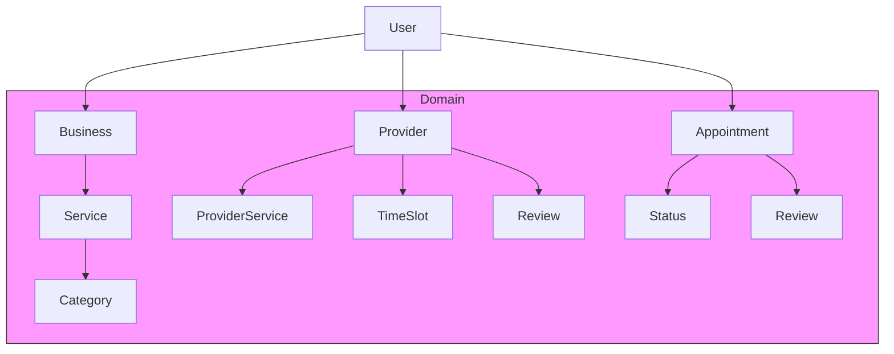

# Universal Appointment System — Backend API

> **Professional README for hiring purposes**

A scalable, multi-tenant appointment management system designed for any
industry—healthcare, beauty, education, fitness, legal services, and more.
Built with clean architecture, JWT authentication, and PostgreSQL for data
persistence. This document provides an overview of the project, its
architecture, setup instructions, API documentation, and usage examples.

---

## 🚀 Project Overview

The backend is an ASP.NET Core Web API that exposes endpoints for
registering users, managing providers and businesses, booking and
tracking appointments, and handling notifications and reviews. The API is
fully documented using Swagger and supports role-based access control.

**Technologies & Tools**

- .NET 8 (ASP.NET Core Web API)
- Entity Framework Core with Npgsql (PostgreSQL)
- JWT Authentication
- Swagger / OpenAPI
- xUnit & Moq for unit and integration tests
- Docker (optional for containerized deployment)

---

## 🏗 Architecture Diagram



---

## 🛠 Setup & Installation

1. Clone the repository and navigate to the `api` folder:
   ```bash
   git clone <repo-url>
   cd api
   ```
2. Restore packages and apply migrations:
   ```bash
   dotnet restore
   dotnet ef migrations add InitialCreate
   dotnet ef database update
   ```
3. Configure `appsettings.json` with your PostgreSQL connection string
   and a strong `Jwt:Key`.
4. Run the application:
   ```bash
   dotnet run
   ```
5. Open Swagger UI at `http://localhost:5000` for interactive API
   exploration.

> Tip: Use environment-specific configuration (Development/Production)
> via `appsettings.Development.json`.

---

## 🔐 Roles & Permissions

| Role     | Description                                              |
| -------- | -------------------------------------------------------- |
| Receiver | Book appointments, cancel, leave reviews                 |
| Provider | Create time slots, manage appointments, reply to reviews |
| Business | Manage business profile and services                     |
| Admin    | Full access including moderation and seed                |
| data     |

---

## 📚 API Endpoints (Selected)

Below is a high-level summary; use Swagger for full details.

### **Authentication**

| Method | Endpoint             | Description                |
| ------ | -------------------- | -------------------------- |
| POST   | `/api/auth/register` | Register new user          |
| POST   | `/api/auth/login`    | Authenticate and issue JWT |

### **Categories**

| Method | Endpoint               | Description             |
| ------ | ---------------------- | ----------------------- |
| GET    | `/api/categories`      | Get full category tree  |
| GET    | `/api/categories/{id}` | Get category by id      |
| POST   | `/api/categories`      | Create category (Admin) |

### **Businesses**

| Method | Endpoint               | Description                |
| ------ | ---------------------- | -------------------------- |
| GET    | `/api/businesses`      | Search & filter            |
| GET    | `/api/businesses/{id}` | Get details                |
| POST   | `/api/businesses`      | Create business (Provider) |
| PUT    | `/api/businesses/{id}` | Update business            |
| DELETE | `/api/businesses/{id}` | Soft delete                |

_(Full endpoint list continues in the Swagger UI.)_

---

## 🧪 Example Workflow

1. Provider registers → `POST /api/auth/register` (role=Provider)
2. Provider creates a business → `POST /api/businesses`
3. Provider adds a service → `POST /api/services`
4. Provider sets availability → `POST /api/timeslots/provider/{id}/bulk`
5. Receiver registers → `POST /api/auth/register` (role=Receiver)
6. Receiver books appointment → `POST /api/appointments`
7. Provider confirms → `PATCH /api/appointments/{id}/status`
8. After completion, receiver reviews provider

---

## 🎯 Seed Data

When the application starts, the following categories are seeded:

- **Health** (Clinic, Dental, Psychology, Physiotherapy)
- **Beauty** (Hairdresser, Makeup, Nail Art)
- **Fitness** (Personal Trainer, Yoga)
- **Entertainment** (Escape Room, Bowling)
- **Education**
- **Legal & Consulting**

---

## 🧩 Testing

Unit and integration tests reside in `api.Tests`.
Run them with:

```bash
cd api.Tests
dotnet test
```

Coverage reports can be generated with coverlet or similar tools.

---

## 🚀 Deployment

Use Docker for containerization or deploy directly to a cloud provider
(e.g. Azure App Service, AWS Elastic Beanstalk) with a PostgreSQL
database.

---

## 📄 License

This project is licensed under the MIT License. See `LICENSE` for details.

---

## 🤝 Contributing

Contributions are welcome! Please fork the repo, create a feature branch,
and submit a pull request. Maintain coding standards, include tests, and
update documentation as needed.

_Thank you for reviewing this backend API. I built it to demonstrate clean
architecture, adherence to SOLID principles, and real-world API design—a
strong showcase for technical interviews._
